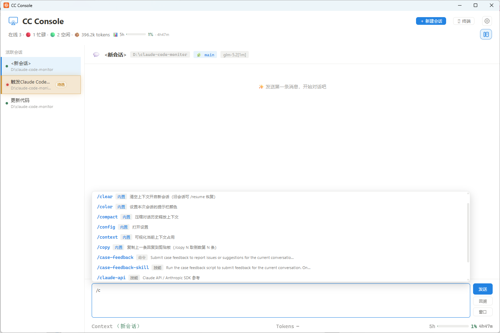

# CC Console

**用一个图形界面替代 PowerShell / 终端来驱动 Claude Code。** 核心是一套完整的「对话页面」——像聊天软件一样和每个 Claude Code 实例交流：发消息、看工具调用与 diff、点按钮回答 Claude 的提问、追踪文件修改，全程不必切回终端。

系统托盘常驻，每秒刷新，跟随系统明暗主题。



---

## 它替你做了什么

日常用 Claude Code，多半是在 PowerShell / Windows Terminal 里手敲：开几个会话就得切几个窗口，Claude 弹个 `AskUserQuestion` 选项还得回终端按上下键，工具调用一长串只能滚屏看，文件改了哪些要自己去翻。CC Console 把这些统统搬进一个 GUI：

- **不用切终端**——左侧会话标签栏并排管理所有实例，点一下就在右侧对话
- **不用回终端选选项**——Claude 提问、要权限、要审批计划，都直接在界面上点按钮
- **不用翻 diff**——Edit / Write 自动渲染成红删绿增的逐行 diff，右侧另有文件修改面板汇总
- **不用算账**——Context 用量、本轮 / 累计 tokens、5 小时配额倒计时实时显示

---

## 💬 对话页面

点任意实例的「对话」按钮（或在对话布局下点左侧标签）即可打开。这是本工具的主体，所有日常交互都在这里完成。


### 消息流：完整、可读

对话正文按 Claude Code 的原生风格渲染，逐条清晰：

- **用户 / 助手气泡**：助手回复完整渲染 Markdown（表格、代码块、引用、列表、分隔线、链接），不再是终端里的纯文本
- **工具调用卡片**：合并展示「调用 + 结果」——头部 `⏺ 工具名(主参数)`，尾部 `⎿ 结果摘要`（如 `读取 128 行`、`命中 7 处`、`✗ Exit 1`），可折叠查看完整调用参数与返回内容
- **连续工具调用分组**：同一轮里连续多次调用自动合并为「连续 N 条」紧凑卡片，展开仍可逐条查看，避免刷屏
- **Edit / Write 内联 diff**：自动解析 `old_string` / `new_string` 做逐行 LCS diff，**红删绿增**、带行号；超大变更回退为 old / new 预览，不卡 UI
- **Markdown 一键下载**：当助手消息被识别为 Markdown 文档（含标题、表格、列表等）时，气泡右上出现「下载 md 文件」按钮，按时间戳自动命名保存

### 右侧文件修改面板

对话区右侧的可折叠面板，**汇集本轮所有 `Edit` / `Write` / `NotebookEdit` 改动**：

- 每条显示 `+N / -M` 增删行数与起始行号，点击即定位到对话里对应的那条工具调用
- 宽度可拖动调整，可一键折叠 / 展开；按会话记忆显隐偏好（隐藏后不再自动弹出）
- 本轮到底动了哪些文件、各改了多少，一目了然

### 交互应答：按钮替代上下键

Claude Code 在终端里需要按键选择的场景，这里全部做成**按钮**，点一下即把答案注入实例：

- **`AskUserQuestion`**：选项渲染为按钮，支持单选、**多选**（带确认提交）、**自定义输入**（Type something —— 输入文本后可把它作为新选项选中）；**多问逐题导航**，一题答完自动推进到下一题
- **Plan 模式**：审批 / 编辑计划，一键应答
- **权限请求**：允许 / 拒绝，直接在面板里完成
- 实时旁路：活跃会话 JSONL 不落盘时，挂起的提问由 hook 实时捕获，照样能渲染按钮

### 输入框：顺手得像本地编辑器

- **发送键可配**：默认 `Enter` 发送、`Shift+Enter` 换行；也可反过来
- **斜杠命令补全**：键入 `/` 弹出命令 / 技能列表，按使用频率排序（最近用过的置顶），方向键选、回车补全，并带参数提示
- **历史消息导航**：`↑` / `↓` 调出之前发过的消息（会话历史 + 本输入框发送栈合并去重）
- **草稿与滚动记忆**：切换会话时草稿与阅读位置都保留，回来时恢复原状
- **回到底部按钮**：滚到上方查看历史时，一键跳回最新消息

### 处理中指示器

复刻 Claude Code 终端风格的 `✻ Channeling…` 动画：处理中随机切换动词（Pondering / Crunching / Thinking…），从任务真实开始时刻计时；任务结束后保留最终用时（带 idle 滞回，避免长任务中途空窗误显示「已完成」）。

### 底部信息条

输入框下方实时显示当前会话的「账本」：

- **Context**：胶囊进度条 + 百分比 + 已用 / 上限（绿 / 黄 / 红分级）
- **Tokens**：本轮输出与累计 input / output / cache 明细
- **配额**：5 小时滚动配额 + 周配额进度条与重置倒计时（GLM 后端）

### 回溯与窗口

- **回溯**：在该实例终端打开 Claude 的历史选择器并自动置前，让用户在原生 TUI 里挑恢复点
- **窗口**：把该实例的终端拉到最前；内置终端实例则切换到应用内对应终端 tab

---

## 🗂 两种布局

右上角按钮一键切换，偏好持久化：

- **对话布局（默认）**：左侧「活跃会话」标签栏（busy / idle 圆点、等待徽标、逐个关闭）+ 右侧对话面板，**同时管理多个会话**
- **列表布局**：以实例卡片为主，点「对话」以弹窗打开对话页面

---

## 🖥 内置终端

顶栏「🖥 终端」打开基于 **ConPTY + xterm.js** 的内置终端：

- 多 tab 管理，新建默认 PowerShell（失败回退 CMD）
- 新建 Claude 实例时可选择「应用内置终端」启动方式——实例在应用内运行，不弹出额外窗口
- 「窗口」按钮可定位到内置实例对应的终端 tab

---

## 🏠 主页：账号用量 + 全局监控

主页一眼看清全局，顶部直接显示当前账号的**用量 / 余额**：

- **顶部用量徽标**（按后端自动切换）：
  - **GLM（z.ai / 智谱）**：`📊 5h 配额` + 进度条 + 百分比 + 重置倒计时，可选 `📅 周` 限额，接近上限自动变橙 / 红
  - **DeepSeek**：`💰 余额 ¥X`
- **全局统计**：在线数、忙碌 / 空闲计数、累计 Context tokens、残留会话数
- **实例卡片**：状态灯（忙碌时脉冲呼吸）、工作目录、模型、运行时长、对话主题、Context 用量进度条、本轮输出与累计 token 明细

### 🚀 一键启动新实例

从监控器直接拉起 Claude Code：手动选目录，或从最近使用目录一键启动；可选外部窗口（显示 / 最小化）或应用内置终端。


---

## 其他功能

- **卡片快捷操作**：`清空`（发 `/clear`）、`对话`、`窗口`
- **排序与筛选**：按最后活动 / 建立时间 / Context 用量排序；按工作目录筛选
- **版本更新**：内置更新检查，自动下载安装包并校验 minisign 签名后替换
- **系统托盘**：关闭窗口隐藏到托盘常驻；单实例（重复启动激活已有窗口）
- **明暗主题**：跟随系统，Notion 风格
- **命令行模式**：`cc-console.exe --list` 打印一次实例表格后退出，适合脚本
- **开机启动**：设置面板一键开关
- **settings.json 守护**：自动检查 / 修复 `~/.claude/settings.json` 里的 statusLine 与 lifecycle hooks 配置漂移

---

## 安装

### 安装包（推荐）

从 [GitHub Releases](https://github.com/pie-tk/cc-console/releases) 下载 `cc-console-setup.exe`，双击安装。支持中文（简体/繁体），自动创建桌面快捷方式。

### 便携版

从 [Releases](https://github.com/pie-tk/cc-console/releases) 下载 `cc-console.exe`，直接运行。

> 环境要求：**Windows 10/11**（WebView2 系统自带）+ **Claude Code CLI** 已安装

---

## 使用

```bash
# GUI 模式（托盘常驻，每秒刷新）
cc-console.exe

# 命令行模式（打印一次后退出）
cc-console.exe --list
```

`--list` 输出示例：

```
在线 Claude Code 实例: 3   (● 忙碌 1   ○ 空闲 2)

PID      状态        模型            Context           本轮   对话主题                     项目 (工作目录)
43920    ● 忙碌      glm-5.1        26% 52k/200k      105    Build app to monitor Clau…   E:\test
22912    ○ 空闲      glm-5.1        13% 27k/200k      55     Update Claude Code version   C:\Users\Administrator
41832    ○ 空闲      （新）          （新）            （新） （新会话·无消息）             ...\BelaHome\belahome
```

---

## 配置

### 自定义模型上下文上限

内置 60+ 模型的上下文上限表。如果你的模型与默认不同，在 `~/.cc-console.json` 覆盖：

```json
{ "modelLimits": { "glm-5.1": 256000 } }
```

### 应用设置

GUI 设置面板（⚙）可配置：关闭按钮行为、新建实例终端模式（内置 / 外部显示 / 外部最小化）、消息发送键、会话标签副标题、开机启动、settings.json 自动检查 / 修复。

---

## 构建

```bash
git clone git@github.com:pie-tk/cc-console.git
cd cc-console

# 一键构建（exe + 安装包）
./build.sh

# 或分步：
cd frontend && npm install && npm run build && cd ..
go build -ldflags="-H windowsgui -s -w" -o cc-console.exe .
```

> 依赖 Go 1.26+、Node.js。国内网络设 `go env -w GOPROXY=https://goproxy.cn,direct`

---

## License

[MIT](LICENSE)
